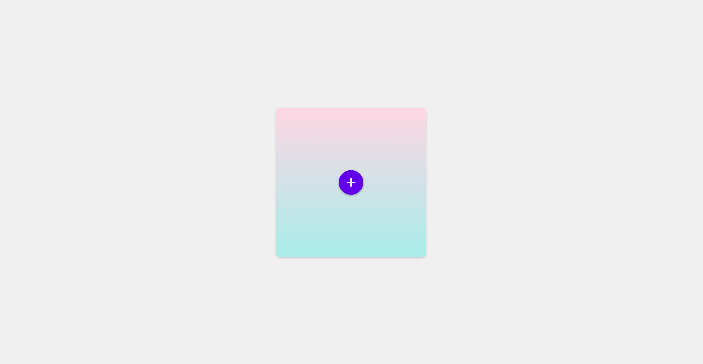

<h1>Expandable Floating Action Button Menu Challenge</h1>

<h2 id="challenge-description">Challenge Description</h2>

This challenge involves creating an interactive Floating Action Button (FAB) menu using HTML, CSS, and JavaScript. The FAB menu expands in a circular pattern when the main FAB button is clicked, providing a visually appealing way to access multiple actions. The background features a stylish linear gradient, enhancing the overall aesthetic of the interface.

<h2>Table of Content</h2>

<ol>
    <li><a href="#challenge-description">Challenge Description</a></li>
    <li><a href="#introduction">Introduction</a></li>
    <li><a href="#purpose">Purpose</a></li>
    <li><a href="#features">Features</a></li>
    <li><a href="#pre-requisites">Pre Requisites</a></li>
    <li><a href="#file-structure">File Structure</a></li>
    <li><a href="#tools">Tools</a></li>
    <li><a href="#preview">Preview</a></li>
    <li><a href="#contributing">Contributing</a></li>
</ol>

<h2 id="introduction">Introduction</h2>

Welcome to the Expandable Floating Action Button (FAB) Menu Challenge! This challenge focuses on creating a modern and interactive menu using HTML, CSS, and JavaScript. The Floating Action Button (FAB) is a widely-used UI element in mobile and web applications, offering quick access to primary actions.

In this challenge, you'll design a FAB menu that expands in a circular pattern when clicked, revealing additional action buttons. The menu will be embedded in a stylish container featuring a linear gradient background, making it visually appealing and functional.

<h2 id="purpose">Purpose</h2>

The purpose of the Expandable Floating Action Button (FAB) Menu Challenge is to develop a modern and interactive UI component that enhances user experience by providing quick access to multiple actions through a visually appealing circular expansion pattern.

<h2 id="features">Features</h2>
<ol>
    <li><strong>Stylish Gradient Background:</strong> The main container has a beautiful linear gradient background, adding a touch of elegance to the design.</li>
    <li><strong>Circular FAB Expansion:</strong> The FAB items expand in a circular pattern around the main FAB, creating a dynamic and interactive user experience.</li>
    <li><strong>Smooth Transitions:</strong> The expansion and contraction of the FAB items are accompanied by smooth CSS transitions, ensuring a fluid user interaction.</li>
    <li><strong>Icon Integration:</strong> Each FAB item includes an icon, enhancing the usability and visual appeal of the menu.</li>
</ol>

<h2 id="pre-requisites">Pre Requisites</h2>
<ol>
    <li>Basic HTML and CSS Knowledge</li>
    <li>Understanding of CSS Gradients</li>
    <li>JavaScript for handling the interactive toggling of the FAB menu.</li>
</ol>

<h2 id="file-structure">File Structure</h2>
<pre>
    Expandable-Floating-Action-Button-Menu-Challenge/
    │
    ├── index.html         # Main HTML file
    ├── styles.css         # CSS file for styling
    ├── scripts.js         # JavaScript file for interactivity
    └── README.md          # Project description and instructions
</pre>

<h2 id="tools">Tools</h2>
<ol>
    <li>Code Editor (e.g., VS Code, Sublime, Atom, etc.)</li>
    <li>Web Browser (e.g., Google Chrome, Mozilla Firefox, Safari, etc.)</li>
    <li>Version Control (Optional) (e.g., Git, GitHub, or any other platform)</li>
</ol>

<h2 id="preview">Preview</h2>

You can also watch the live demo on my CodePen: <a href="https://codepen.io/Yashi-the-lessful/pen/RwmmdJX">Expandable FAB Menu Demo</a>

Below is the Screenshot of the Expandable FAB Menu Challenge:

<h2 id="contributing">Contributing</h2>

Thank you for considering contributing to the Expandable Floating Action Button (FAB) Menu Challenge! Contributions are welcome and encouraged. To contribute, please follow these guidelines:

<h3>How to Contribute</h3>

<ol>
    <li><strong>Fork the Repository:</strong> Start by forking the repository to your own GitHub account.</li>
    <li><strong>Clone the Repository:</strong> Clone the forked repository to your local machine using Git.</li>
    <li><strong>Make Changes:</strong> Implement your changes and improvements to the HTML (<code>index.html</code>), CSS (<code>styles.css</code>), or JavaScript (<code>scripts.js</code>) files. Ensure your code follows best practices and is well-commented.</li>
    <li><strong>Test Your Changes:</strong> Verify that your modifications work as intended by testing them in different browsers and screen sizes.</li>
    <li><strong>Commit Your Changes:</strong> Commit your changes with a clear and descriptive commit message.</li>
    <li><strong>Push to Your Fork:</strong> Push your changes to your forked repository on GitHub.</li>
    <li><strong>Submit a Pull Request:</strong> Go to your forked repository on GitHub and submit a pull request to the main repository. Provide a detailed description of your changes and why they are beneficial.</li>
</ol>
